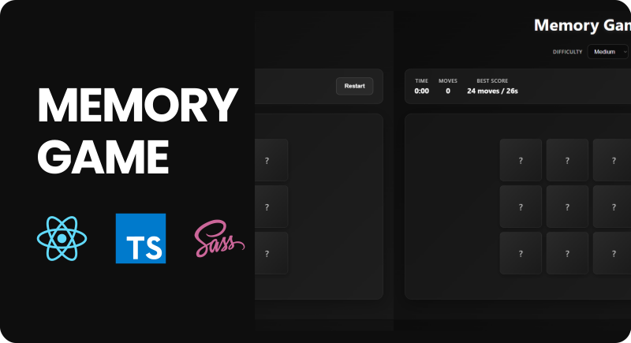

<p align="center">
  
</p>

<p align="center">
  
  
  
</p>

<h1 align="center">🧠 Memory Game</h1>

<p align="center">
  An engaging memory game built to challenge your cognitive skills. Featuring a minimalist black-and-white theme, this game combines <b>React</b> for dynamic interactivity, <b>SCSS</b> for stylish theming, and <b>Vite</b> for blazing-fast performance. It offers smooth animations and a responsive design.
</p>

---

## ✨ Features

- 🎮 Interactive memory matching gameplay
- 🌀 Smooth card flip and fade animations
- 🏆 Congratulatory modal with score and time stats
- 📱 Fully responsive for mobile and desktop
- ⚡ Fast and optimized with React + Vite

---

## 🌐 Demo

🔗 **Live Demo**: [Memory Game](https://memory-concentration-game.vercel.app)

---

## ⚡ Quick Start

Follow these steps to get a local copy of the project up and running.

### 1️⃣ Clone the repository

```bash
git clone https://github.com/Renz-Eryll/Memory_Game.git
```

### 2️⃣ Install dependencies

```bash
npm install
```

### 3️⃣ Start the development server

```bash
npm run dev
```

Open **http://localhost:5173** in your browser to view the game 🚀

---

## 📧 Contact

- **Name**: Renz Eryll Ramelo
- **LinkedIn**: [www.linkedin.com/in/renz-eryll-ramelo](https://www.linkedin.com/in/renz-eryll-ramelo)
- **GitHub**: [https://github.com/Renz-Eryll](https://github.com/Renz-Eryll)
